# JARKOM MODUL 1 2026 - K01

## Member

| Nama | NRP |
| --- | --- |
| Umar | 5027251005 |
| Syarifah Nailatur Rohma | 5027251109 |

## Laporan

1. Untuk mempersiapkan pembangunan The Wired, Lain yang berperan sebagai Router membuat tiga Switch/Gateway: Switch 1 menuju dua Entitas yaitu Alice dan Mika, Switch 2 menuju Chisa, sedangkan Switch 3 menuju Knights dan Eiri. Kelima Entitas tersebut dikonfigurasi sebagai Client di GNS3.

Pertama, dibuat topologi jaringan sesuai dengan pembagian node pada soal. Lain menjadi router yang menghubungkan ketiga segmen jaringan, sedangkan kelima entitas menjadi client pada switch masing-masing.


Komponen yang digunakan pada topologi tersebut adalah sebagai berikut:

- **NAT:** menyediakan koneksi menuju internet dan layanan DHCP untuk interface luar Lain.
- **Router Lain:** menghubungkan jaringan internet dengan ketiga subnet client, menggunakan image `debinet`.
- **Switch 1:** menghubungkan Alice dan Mika dengan interface LAN Lain pada segmen pertama.
- **Switch 2:** menghubungkan Chisa dengan interface LAN Lain pada segmen kedua.
- **Switch 3:** menghubungkan Knights dan Eiri dengan interface LAN Lain pada segmen ketiga.
- **Client:** Alice, Mika, Chisa, Knights, dan Eiri menggunakan image `alpinet`.

Prefix IP kelompok kami adalah `10.64.X.X`. Pembagian subnet dan gateway yang digunakan adalah sebagai berikut. Alamat gateway dikonfigurasi pada interface router Lain yang terhubung ke masing-masing switch.

| Segmen | Client | Subnet | Gateway pada Lain |
| --- | --- | --- | --- |
| Switch 1 | Alice, Mika | 10.64.1.0/24 | 10.64.1.1 |
| Switch 2 | Chisa | 10.64.2.0/24 | 10.64.2.1 |
| Switch 3 | Knights, Eiri | 10.64.3.0/24 | 10.64.3.1 |


2. Karena menurut Lain pada saat itu The Wired masih terisolasi dari dunia luar, konfigurasikan router Lain agar dapat tersambung langsung ke jaringan internet publik melalui NAT/DHCP pada interface eth0.

Untuk membuat Lain terhubung ke internet, interface **eth0** yang terhubung dengan NAT dikonfigurasi agar memperoleh alamat IP melalui DHCP. Konfigurasi yang digunakan pada file `/etc/network/interfaces` adalah sebagai berikut:

```text
auto eth0
iface eth0 inet dhcp
```

Setelah konfigurasi diterapkan, alamat interface dan default route diperiksa menggunakan `ip -br a` dan `ip route`.


Selanjutnya dilakukan pengujian koneksi dari Lain ke `8.8.8.8` untuk memastikan router dapat menjangkau jaringan internet.


3. Setelah router Lain terhubung ke internet, pastikan seluruh Entitas (Client) di bawah Switch 1, Switch 2, dan Switch 3 dapat saling terhubung dan berkomunikasi satu sama lain melalui konfigurasi routing.

Agar seluruh client dapat berkomunikasi, setiap interface LAN pada Lain diberikan alamat IP statis yang menjadi gateway bagi subnet terkait. Konfigurasi interface LAN Lain adalah sebagai berikut:

```text
auto eth1
iface eth1 inet static
    address 10.64.1.1
    netmask 255.255.255.0

auto eth2
iface eth2 inet static
    address 10.64.2.1
    netmask 255.255.255.0

auto eth3
iface eth3 inet static
    address 10.64.3.1
    netmask 255.255.255.0
```


Selanjutnya, masing-masing client diberikan alamat IP statis dan default gateway sesuai dengan segmennya. Konfigurasi yang digunakan pada setiap node adalah sebagai berikut:

**Alice**

```text
auto eth0
iface eth0 inet static
    address 10.64.1.2
    netmask 255.255.255.0
    gateway 10.64.1.1
    up echo "nameserver 192.168.122.1" > /etc/resolv.conf
```

**Mika**

```text
auto eth0
iface eth0 inet static
    address 10.64.1.3
    netmask 255.255.255.0
    gateway 10.64.1.1
    up echo "nameserver 192.168.122.1" > /etc/resolv.conf
```

**Chisa**

```text
auto eth0
iface eth0 inet static
    address 10.64.2.2
    netmask 255.255.255.0
    gateway 10.64.2.1
    up echo "nameserver 192.168.122.1" > /etc/resolv.conf
```

**Knights**

```text
auto eth0
iface eth0 inet static
    address 10.64.3.2
    netmask 255.255.255.0
    gateway 10.64.3.1
    up echo "nameserver 192.168.122.1" > /etc/resolv.conf
```

**Eiri**

```text
auto eth0
iface eth0 inet static
    address 10.64.3.3
    netmask 255.255.255.0
    gateway 10.64.3.1
    up echo "nameserver 192.168.122.1" > /etc/resolv.conf
```


Pada Lain, IP forwarding diaktifkan agar paket dapat diteruskan antarinterface. Jika terdapat pembatasan firewall, aturan FORWARD disesuaikan agar trafik antarsegmen diizinkan.

```text
sysctl -w net.ipv4.ip_forward=1
```


Ketiga subnet LAN merupakan jaringan yang terhubung langsung ke Lain, sehingga route menuju subnet tersebut tercatat sebagai connected routes. Client menggunakan default gateway untuk mencapai subnet lain. Selanjutnya dilakukan ping dari setiap client menuju empat client lainnya.


4. Lain ingin agar setiap Entitas (Client) memiliki kemandirian di The Wired. Konfigurasikan firewall/iptables (NAT Masquerade) dan DNS resolver agar setiap Client dapat terhubung ke internet secara mandiri (dapat melakukan ping ke 192.168.122.1 dan membuka domain web google.com).

Untuk memberikan akses internet kepada seluruh client, dilakukan konfigurasi NAT Masquerade pada Lain. Aturan ini mengganti alamat sumber paket dari jaringan client dengan alamat interface keluar Lain, yaitu **eth0**.

```text
iptables -t nat -A POSTROUTING -o eth0 -j MASQUERADE
iptables -A FORWARD -i eth1 -o eth0 -j ACCEPT
iptables -A FORWARD -i eth2 -o eth0 -j ACCEPT
iptables -A FORWARD -i eth3 -o eth0 -j ACCEPT
```


Selanjutnya dilakukan konfigurasi DNS resolver pada masing-masing client agar nama domain dapat diterjemahkan menjadi alamat IP. Resolver yang digunakan adalah `192.168.122.1` dengan konfigurasi berikut, lalu dilakukan pengujian koneksi ke internet.

```text
up echo "nameserver 192.168.122.1" > /etc/resolv.conf
```


5. Eiri tetap berupaya menanamkan kekacauan ke dalam jaringan. Untuk mengantisipasi restart tiba-tiba, pastikan seluruh konfigurasi jaringan tidak hilang saat semua node di-restart. Buat script verifikasi di /root/cek_status.sh pada router Lain yang menampilkan ringkasan interface (ip -br a) dan status tabel NAT (iptables -t nat -L -v -n) setelah reboot.

Agar konfigurasi tetap berlaku setelah restart, pengaturan interface, route, DNS, IP forwarding, dan aturan iptables disimpan melalui mekanisme startup yang digunakan pada node.

**Lain**

```bash
#!/bin/bash

cat <<EOF > /etc/network/interfaces
auto eth0
iface eth0 inet dhcp

auto eth1
iface eth1 inet static
    address 10.64.1.1
    netmask 255.255.255.0

auto eth2
iface eth2 inet static
    address 10.64.2.1
    netmask 255.255.255.0

auto eth3
iface eth3 inet static
    address 10.64.3.1
    netmask 255.255.255.0
EOF

apt update
which iptables &>/dev/null || apt install iptables -y

iptables -t nat -A POSTROUTING -o eth0 -j MASQUERADE

iptables -A FORWARD -i eth1 -o eth0 -j ACCEPT
iptables -A FORWARD -i eth2 -o eth0 -j ACCEPT
iptables -A FORWARD -i eth3 -o eth0 -j ACCEPT

/root/cek_status.sh
```

**Client**

```bash
<!-- Alice -->
#!/bin/sh

cat <<EOF > /etc/network/interfaces
auto eth0
iface eth0 inet static
    address 10.64.1.2
    netmask 255.255.255.0
    gateway 10.64.1.1
    up echo "nameserver 192.168.122.1" > /etc/resolv.conf
EOF

<!-- Mika -->
#!/bin/sh

cat <<EOF > /etc/network/interfaces
auto eth0
iface eth0 inet static
    address 10.64.1.3
    netmask 255.255.255.0
    gateway 10.64.1.1
    up echo "nameserver 192.168.122.1" > /etc/resolv.conf
EOF

<!-- Chisa -->
#!/bin/sh

cat <<EOF > /etc/network/interfaces
auto eth0
iface eth0 inet static
    address 10.64.2.2
    netmask 255.255.255.0
    gateway 10.64.2.1
    up echo "nameserver 192.168.122.1" > /etc/resolv.conf
EOF

<!-- Knights -->
#!/bin/sh

cat <<EOF > /etc/network/interfaces
auto eth0
iface eth0 inet static
    address 10.64.3.2
    netmask 255.255.255.0
    gateway 10.64.3.1
    up echo "nameserver 192.168.122.1" > /etc/resolv.conf
EOF
#
<!-- Eiri -->
#!/bin/sh

cat <<EOF > /etc/network/interfaces
auto eth0
iface eth0 inet static
    address 10.64.3.3
    netmask 255.255.255.0
    gateway 10.64.3.1
    up echo "nameserver 192.168.122.1" > /etc/resolv.conf
EOF
```

Kemudian dibuat script `/root/cek_status.sh` pada Lain untuk memeriksa alamat interface dan tabel NAT setelah node dinyalakan kembali.

```bash
#!/bin/sh

sysctl -w net.ipv4.ip_forward=1

iptables -t nat -A POSTROUTING -o eth0 -j MASQUERADE
iptables -A FORWARD -i eth1 -o eth0 -j ACCEPT
iptables -A FORWARD -i eth2 -o eth0 -j ACCEPT
iptables -A FORWARD -i eth3 -o eth0 -j ACCEPT
```


6. Mika mencurigai adanya anomali traffic pada segmen jaringannya. Jalankan generator traffic berikut ([link file](https://drive.google.com/drive/folders/1ZjFvWIjvAQAjE9pPthm7V_bGyaSt93lY?usp=sharing)) pada node Mika, lalu lakukan packet sniffing menggunakan Wireshark pada interface node Mika. Terapkan display filter khusus untuk menyaring paket yang berprotokol DNS atau ICMP. Tunjukkan screenshot hasil filter beserta ringkasan paket yang lolos.

File [`traffic_protocol7.sh`](artefacts/traffic_protocol7.sh) dijalankan pada Mika untuk menghasilkan traffic DNS dan ICMP. Berikut isi script tersebut.

```bash
#!/bin/bash
# ============================================
# Traffic Generator — Protocol 7 Network
# Serial Experiments Lain — Modul 1 Jarkom 2026
# Jalankan di node MIKA untuk generate traffic DNS & ICMP
# ============================================

echo "============================================"
echo "  Protocol 7 Traffic Generator v2026"
echo "  Node: Mika Iwakura"
echo "============================================"
echo "[*] Generating DNS & ICMP traffic..."

# ICMP Traffic
ping -c 5 8.8.8.8 &
ping -c 5 1.1.1.1 &
ping -c 3 its.ac.id &

# DNS Queries
nslookup google.com 8.8.8.8 &
nslookup its.ac.id 8.8.8.8 &
nslookup github.com 1.1.1.1 &
dig @8.8.8.8 example.com A &
dig @1.1.1.1 cloudflare.com AAAA &

wait
echo "[*] Traffic generation complete."
echo "[*] Check Wireshark for captured packets."
```

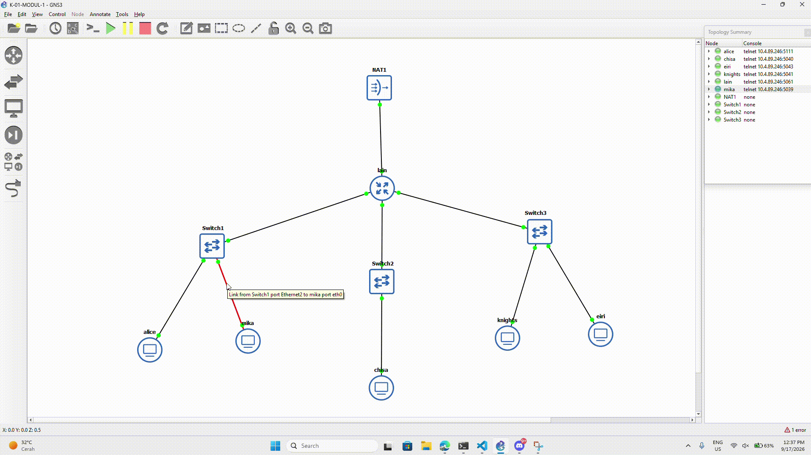

Pada Wireshark diterapkan display filter berikut:

```text
dns || icmp
```

Filter tersebut menampilkan paket DNS atau ICMP. DNS digunakan untuk mengamati resolusi nama, sedangkan ICMP dapat memperlihatkan pesan seperti Echo Request dan Echo Reply.

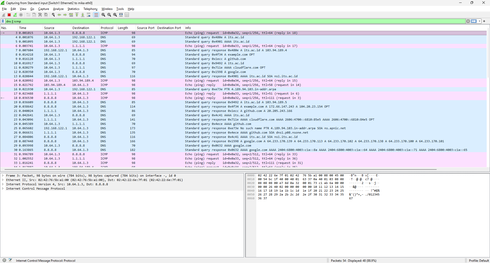

Ringkasan paket yang lolos filter adalah sebagai berikut:

| Protokol |          Jumlah paket | Sumber dan tujuan                                         | Informasi paket                                                                                                                                |
| -------- | --------------------: | --------------------------------------------------------- | ---------------------------------------------------------------------------------------------------------------------------------------------- |
| DNS      | **22 packet** | Mika ↔ `8.8.8.8`, Mika ↔ `1.1.1.1`                        | Query/response `its.ac.id`, `example.com`, `github.com`, `cloudflare.com`, dan `google.com`. Record yang terlihat meliputi **A** dan **AAAA**. |
| ICMP     |          **26 paket** | Mika ↔ `8.8.8.8`, Mika ↔ `1.1.1.1`, Mika ↔ `103.94.189.4` | ICMP **Echo Request (Type 8, Code 0)** dan **Echo Reply (Type 0, Code 0)** dengan pola request–reply.                                          |

file capture: [`mika-capture-icmp-dns.pcapng`](./captures/capture_mika_icmp_dns.pcapng).

7. Chisa memutuskan mendirikan FTP Server pada node miliknya dengan shared folder di /var/wired/data. Terapkan kebijakan akses: user alice (hak akses read & write), user mika (dibatasi read-only), dan user eiri (dibatasi tanpa izin akses / blacklist). Buktikan konfigurasi dengan membuat file signal_alice.txt dari user alice, dan buktikan penolakan akses saat user eiri mencoba login.

Pertama dilakukan instalasi FTP server pada Chisa menggunakan `vsftpd`. Kemudian dibuat direktori `/var/wired/data` sebagai shared folder dan akun yang diperlukan untuk pengujian.

```bash
apk update
apk add vsftpd

id alice >/dev/null 2>&1 || adduser -D alice
echo "alice:alice123" | chpasswd

id mika >/dev/null 2>&1 || adduser -D mika
echo "mika:mika123" | chpasswd

id eiri >/dev/null 2>&1 || adduser -D eiri
echo "eiri:eiri123" | chpasswd

mkdir -p /var/wired/data

chown alice:alice /var/wired/data
chmod 755 /var/wired/data
```

Selanjutnya dilakukan pengaturan layanan FTP beserta kebijakan akses setiap user. Akun alice diberi hak baca dan tulis, mika hanya diberi hak baca, sedangkan eiri dimasukkan ke blacklist agar login ditolak.

```text
<!-- /etc/vsftpd.conf -->
listen=YES
listen_address=0.0.0.0
anonymous_enable=NO
local_enable=YES
write_enable=YES
local_root=/var/wired/data
chroot_local_user=YES
allow_writeable_chroot=YES
user_config_dir=/etc/vsftpd/users
userlist_enable=YES
userlist_deny=YES
userlist_file=/etc/vsftpd/user_list
pasv_enable=YES
pasv_min_port=30000
pasv_max_port=30100
local_umask=022
seccomp_sandbox=NO

<!-- /etc/vsftpd/users/alice -->
write_enable=YES

<!-- /etc/vsftpd/users/mika -->
write_enable=NO

<!-- /etc/vsftpd/users_list -->
eiri

<!-- restart vsftpd -->
pkillall vsftpd
vsftpd /etc/vsftpd.conf &
```

Lalu, dilakukan pengujian menggunakan akun **alice** untuk membuat atau mengunggah `signal_alice.txt` melalui FTP.

```bash
lftp -u alice,alice123 10.64.2.2

put signal_alice.txt
ls
```

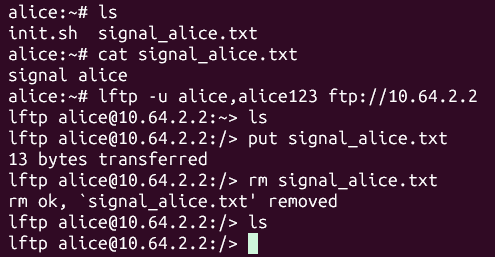

Berikutnya dilakukan percobaan login menggunakan akun **eiri**.

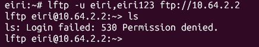

8. Kelompok rahasia Knights perlu mengirimkan dokumen laporan intelijen ke FTP Server Chisa. Lakukan koneksi FTP client dari node Knights ke FTP Server Chisa menggunakan akun alice. Upload file berikut ([link file](https://drive.google.com/drive/folders/1tvZpueSH9E3GWwXM6KNnM64Y5wNoIAYP?usp=sharing)). Analisis sesi Wireshark dan sebutkan: perintah FTP untuk upload (STOR), kode status sukses server (226), dan port data TCP yang dinegosiasikan pada mode PASV.

File [`knights_report.txt](artefacts/knights_report.txt). Selanjutnya dilakukan koneksi ke FTP server Chisa menggunakan akun alice dan mode PASV.

```bash
lftp -u alice,alice123 ftp://10.64.2.2
set ftp:passive-mode true
```

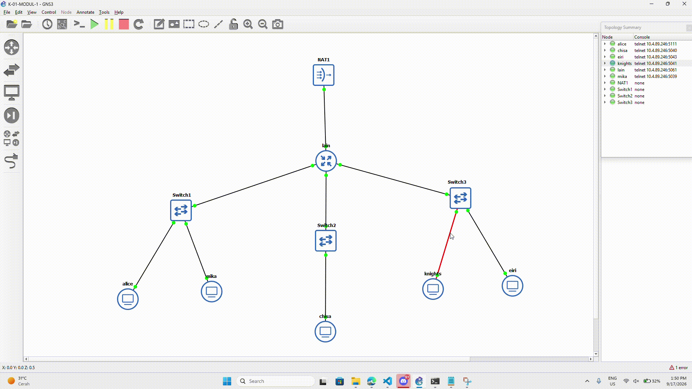

Pada Wireshark, FTP diperiksa untuk menemukan perintah `PASV`, respons `227`, perintah `STOR`, serta respons `226` yang berkaitan dengan transfer dokumen.

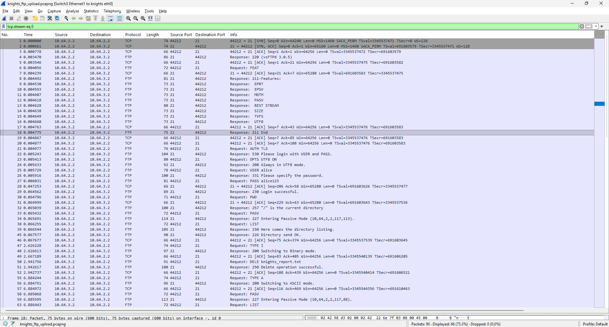

`STOR` merupakan perintah untuk menyimpan file pada server. Respons `226` menunjukkan penyelesaian transfer. Pada mode PASV, port data dihitung dari dua angka terakhir respons `227` dengan rumus `(p1 * 256) + p2`.

| Informasi | Hasil capture |
| --- | --- |
| Perintah upload dan nama file | STOR knights_report.txt |
| Respons penyelesaian transfer | 226 Transfer complete. |
| Respons PASV | 227 Entering Passive Mode (10,64,2,2,117,131). |
| Perhitungan port data | (117 × 256) + 131 = 30083 |
| IP:port client dan IP:port server pada kanal data | 10.64.3.2:50926 → 10.64.2.2:30083 |

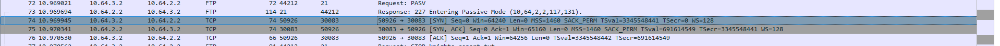

file capture: [`knights-ftp-upload.pcapng`](./captures/knights_ftp_upload.pcapng)

9. Mika mengakses dokumen Protokol Tujuh di ([link file](https://drive.google.com/drive/folders/1S3hG0dnZBTkCta4uILWwKVc6dSYYGRJ6?usp=sharing)) dari FTP Server Chisa. Dari node Mika, unduh file tersebut menggunakan akun mika. Setelah itu, buktikan pembatasan read-only dengan mencoba mengunggah file baru dari akun mika, dan tunjukkan pesan error respon server (error 550 Permission denied) saat mika mencoba melakukan upload.

File [`protocol7_manifesto.txt`](artefacts/protocol7_manifesto.txt) ditaruh pada direktori `/var/wired/data` di node Chisa. 

Lalu, dari node Mika dilakukan login menggunakan akun mika dan download dokumen tersebut.

```bash
lftp -u mika,mika123 ftp://10.64.2.2
get protocol7_manifesto.txt
```

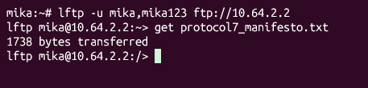

Untuk menguji pembatasan read-only, dibuat file percobaan pada Mika dan dilakukan upload melalui akun yang sama.

```bash
lftp -u mika,mika123 ftp://10.64.2.2
put mika_upload_test.txt
```

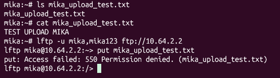

10. Knights melancarkan uji ketahanan koneksi ke server Chisa untuk menguji latensi jaringan The Wired. Kirimkan paket ping dari node Knights ke node Chisa dengan payload khusus 128 bytes dan interval 0.3 detik sebanyak 77 paket. Buka Wireshark, catat nilai ICMP Type dan Code untuk Echo Request vs Echo Reply, serta analisis packet loss dan RTT (min/avg/max).

Pengujian dilakukan dari Knights menuju Chisa menggunakan perintah berikut:

```bash
ping -c 77 -s 128 -i 0.3 10.64.2.2
```

- `-c 77`: mengirimkan 77 paket Echo Request.
- `-s 128`: menggunakan payload ICMP sebesar 128 bytes.
- `-i 0.3`: memberikan interval 0,3 detik antarpengiriman.

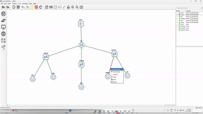

Pada saat pengujian berlangsung, capture dijalankan untuk mengamati paket ICMP. Filter yang digunakan adalah sebagai berikut:

```wireshark
icmp.type == 8 || icmp.type == 0
```
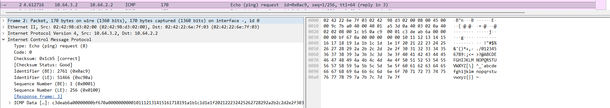

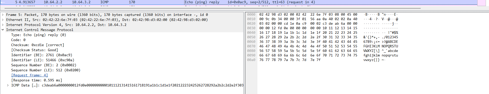

Ringkasan hasil pengujian adalah sebagai berikut:

| Parameter                 | Hasil    |
| ------------------------- | -------- |
| Paket dikirim             | 77 paket |
| Paket diterima            | 77 paket |
| Packet loss               | 0%       |
| RTT minimum               | 0.332 ms |
| RTT rata-rata             | 0.603 ms |
| RTT maksimum              | 1.241 ms |
| Echo Request: Type / Code | 8 / 0    |
| Echo Reply: Type / Code   | 0 / 0    |

RTT menunjukkan waktu perjalanan paket menuju tujuan dan kembali ke pengirim. Ukuran frame pada Wireshark lebih besar dari payload 128 bytes karena mencakup header protokol.

Berdasarkan hasil tersebut, kondisi koneksi Knights ke Chisa tergolong stabil. Seluruh 77 paket yang dikirim berhasil diterima kembali tanpa packet loss. Nilai RTT minimum sebesar 0.332 ms, rata-rata 0.603 ms, dan maksimum 1.241 ms menunjukkan bahwa komunikasi antar-node berlangsung dengan cepat dan memiliki latensi yang rendah.


file capture : [`knights_icmp_chisa.pcapng`](captures/knights_icmp_chisa.pcapng)

14. Pada soal ini kita diminta untuk melakukan analisis file capture `wired_bruteforce.pcapng` untuk mengidentifikasi alamat IP penyerang, target IP beserta port yang diserang, password user `lain_admin`, serta web server software dan versinya.

*Langkah Penyelesaian*

Langkah pertama kita lihat lewat menu **Statistics -> Conversations**, disini kita akan mencari di TCP untuk melihat IP penyerang, target IP, dan port nya. Klik dua kali kolom 'Bytes' untuk mengurutkan data dari angka yang paling besar ke paling kecil dan melihat adanya komunikasi dua IP dengan jumlah paket yang sangat timpang dan angkanya jauh di atas rata-rata trafik lain, itu adalah indikasi kuat aliran serangan.


Selanjutnya, untuk mencari password user `lain_admin`, web server software dan versinya. Karena kita sudah tau nama akunnya maka, selanjutnya kita menfilter dengan `frame contains lain_admin`. Lalu kita klik kanan, **follow TCP stream**. Kita akan melihat password akun dan web server software beserta versinya.


15. Pada soal ini kita diminta untuk melakukan analisis file capture `wired_usb_hid.pcap` untuk mengidentifikasi Vendor ID dan Product ID perangkat USB dari deskriptor USB, alamat nomor device USB, serta pesan rahasia yang berhasil dicuri dari keystroke.

*Langkah Penyelesaian*

Mulai dengan mencari Vendor ID & Product ID, filter packet dengan `usb.bDescriptorType==1` untuk mencari informasi identitas utama perangkat lalu cari dengan info `"GET DESCRIPTOR Response DEVICE"`. Terdapat Device Descriptor yang berisi ID Vendor dan Product.

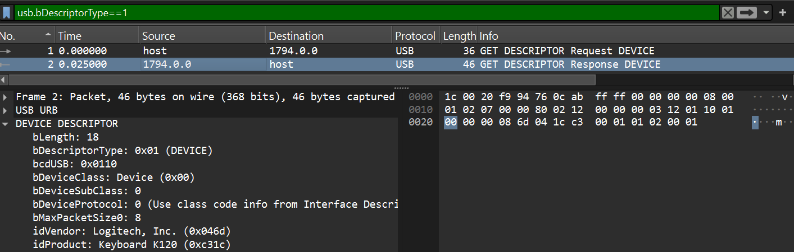

Selanjutnya, aku buka menu **Statistics -> Conversations** dan di bagian USB untuk melihat alamat device USB. Disini Address A hanya 2 yaitu host dan `2.7.1`, dari sini kita tau bahwa `2.7.1` adalah Alamatnya. Namun, alamat USB biasanya Bus.Device.Endpoint maka dari itu nomor Device USB ada 7.

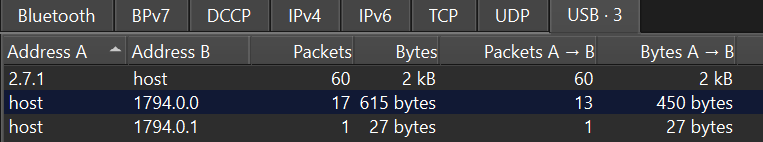

Untuk mendapatkan pesan rahasia, dilakukan filter dengan `usb.capdata`. Disini kita bisa lihat keystroke di `Leftover Capture Data`. Lalu, kita baca `Byte 0` (untuk modifier keys) dan `Byte 2` (untuk tombol utama yang sedang dipegang) untuk mencari pesan rahasianya.

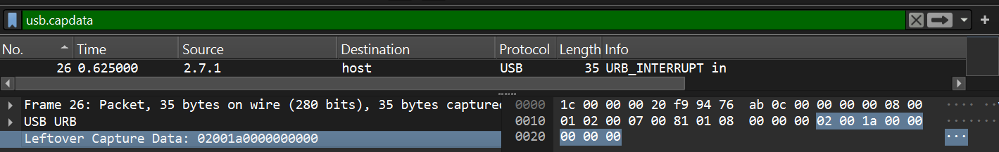.

*Berikut adalah bagaimana kami menerjemahkan Byte nya:*
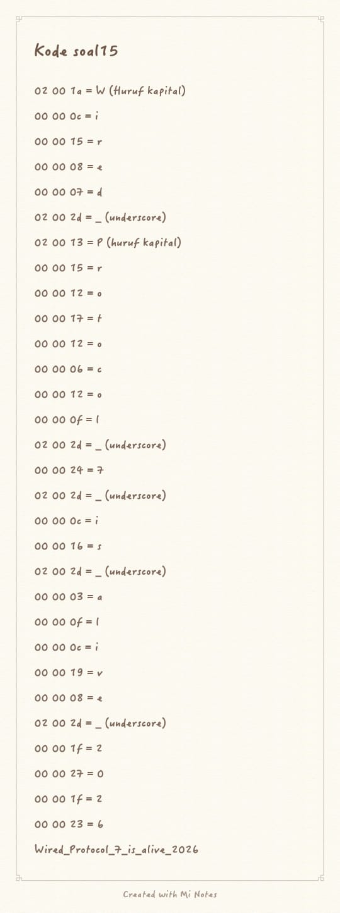

*Berikut adalah validasi temuan kami:*
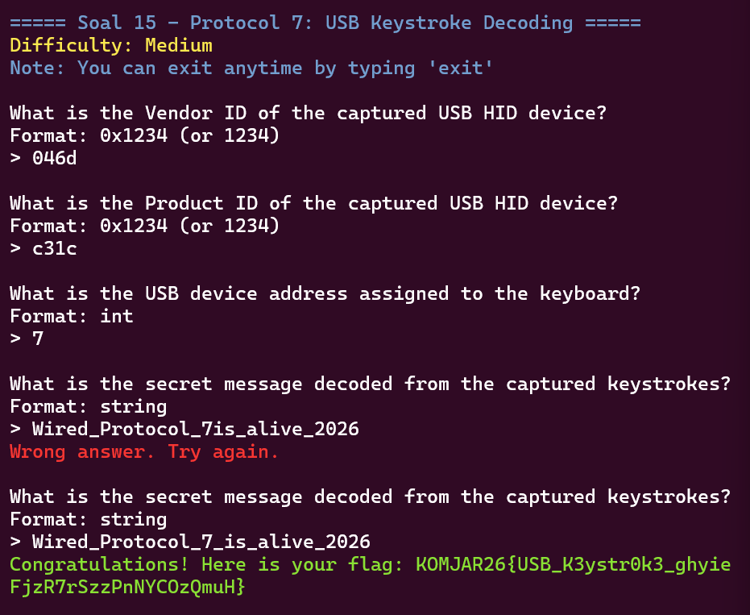

16. Pada soal ini kita diminta untuk melakukan analisis lalu lintas FTP untuk mengidentifikasi alamat IP server FTP penyerang, banner software FTP yang digunakan, kredensial login penyerang, serta ukuran (size in bytes) dari file malware knights_payload.exe yang diunduh.

*Langkah Penyelesaian*

Pertama, kita filterkan dengan `ftp.response.code==220`. Disini kita memakai kode `220` karena kode ini digunakan untuk mengundang klien untuk mengirimkan kredensial otentikasi (nama pengguna dan kata sandi). 
Kita menemukan Packet dengan info `220 Welcome to Wired FTP Server (vsftpd 3.0.5)`. Source pada packet tersebut adalah alamat IP server FTP penyerang dan info `(vsftpd 3.0.5)` adalah banner software FTP. 


Selanjutnya, kita bisa klik kanan dan **follow TCP stream**, disini kita akan terjawab kredensial login penyerang, serta ukuran (size in bytes) dari file malware.


