# JARKOM MODUL 1 2026 - K01

## Member

| Nama | NRP |
| --- | --- |
| Umar | 5027251005 |
| Syarifah Nailatur Rohma | 5027251109 |

## Laporan

1. Untuk mempersiapkan pembangunan The Wired, Lain yang berperan sebagai Router membuat tiga Switch/Gateway: Switch 1 menuju dua Entitas yaitu Alice dan Mika, Switch 2 menuju Chisa, sedangkan Switch 3 menuju Knights dan Eiri. Kelima Entitas tersebut dikonfigurasi sebagai Client di GNS3.

Pertama, dibuat topologi jaringan sesuai dengan pembagian node pada soal. Lain menjadi router yang menghubungkan ketiga segmen jaringan, sedangkan kelima entitas menjadi client pada switch masing-masing.


Komponen yang digunakan pada topologi tersebut adalah sebagai berikut:

- **NAT:** menyediakan koneksi menuju internet dan layanan DHCP untuk interface luar Lain.
- **Router Lain:** menghubungkan jaringan internet dengan ketiga subnet client, menggunakan image `debinet`.
- **Switch 1:** menghubungkan Alice dan Mika dengan interface LAN Lain pada segmen pertama.
- **Switch 2:** menghubungkan Chisa dengan interface LAN Lain pada segmen kedua.
- **Switch 3:** menghubungkan Knights dan Eiri dengan interface LAN Lain pada segmen ketiga.
- **Client:** Alice, Mika, Chisa, Knights, dan Eiri menggunakan image `alpinet`.

Prefix IP kelompok kami adalah `10.64.X.X`. Pembagian subnet dan gateway yang digunakan adalah sebagai berikut. Alamat gateway dikonfigurasi pada interface router Lain yang terhubung ke masing-masing switch.

| Segmen | Client | Subnet | Gateway pada Lain |
| --- | --- | --- | --- |
| Switch 1 | Alice, Mika | 10.64.1.0/24 | 10.64.1.1 |
| Switch 2 | Chisa | 10.64.2.0/24 | 10.64.2.1 |
| Switch 3 | Knights, Eiri | 10.64.3.0/24 | 10.64.3.1 |


2. Karena menurut Lain pada saat itu The Wired masih terisolasi dari dunia luar, konfigurasikan router Lain agar dapat tersambung langsung ke jaringan internet publik melalui NAT/DHCP pada interface eth0.

Untuk membuat Lain terhubung ke internet, interface **eth0** yang terhubung dengan NAT dikonfigurasi agar memperoleh alamat IP melalui DHCP. Konfigurasi yang digunakan pada file `/etc/network/interfaces` adalah sebagai berikut:

```text
auto eth0
iface eth0 inet dhcp
```

Setelah konfigurasi diterapkan, alamat interface dan default route diperiksa menggunakan `ip -br a` dan `ip route`.

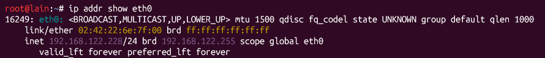

Selanjutnya dilakukan pengujian koneksi dari Lain ke `8.8.8.8` untuk memastikan router dapat menjangkau jaringan internet.

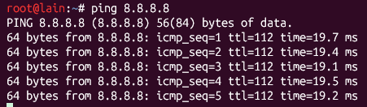

3. Setelah router Lain terhubung ke internet, pastikan seluruh Entitas (Client) di bawah Switch 1, Switch 2, dan Switch 3 dapat saling terhubung dan berkomunikasi satu sama lain melalui konfigurasi routing.

Agar seluruh client dapat berkomunikasi, setiap interface LAN pada Lain diberikan alamat IP statis yang menjadi gateway bagi subnet terkait. Konfigurasi interface LAN Lain adalah sebagai berikut:

```text
auto eth1
iface eth1 inet static
    address 10.64.1.1
    netmask 255.255.255.0

auto eth2
iface eth2 inet static
    address 10.64.2.1
    netmask 255.255.255.0

auto eth3
iface eth3 inet static
    address 10.64.3.1
    netmask 255.255.255.0
```

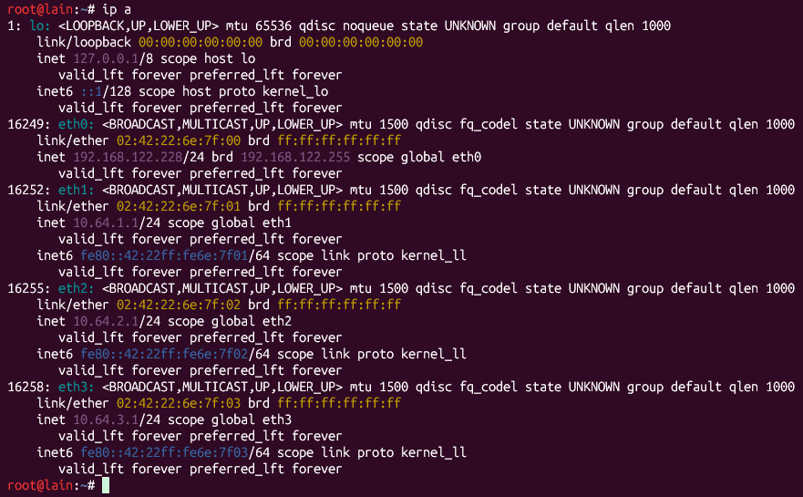

Selanjutnya, masing-masing client diberikan alamat IP statis dan default gateway sesuai dengan segmennya. Konfigurasi yang digunakan pada setiap node adalah sebagai berikut:

**Alice**

```text
auto eth0
iface eth0 inet static
    address 10.64.1.2
    netmask 255.255.255.0
    gateway 10.64.1.1
    up echo "nameserver 192.168.122.1" > /etc/resolv.conf
```

**Mika**

```text
auto eth0
iface eth0 inet static
    address 10.64.1.3
    netmask 255.255.255.0
    gateway 10.64.1.1
    up echo "nameserver 192.168.122.1" > /etc/resolv.conf
```

**Chisa**

```text
auto eth0
iface eth0 inet static
    address 10.64.2.2
    netmask 255.255.255.0
    gateway 10.64.2.1
    up echo "nameserver 192.168.122.1" > /etc/resolv.conf
```

**Knights**

```text
auto eth0
iface eth0 inet static
    address 10.64.3.2
    netmask 255.255.255.0
    gateway 10.64.3.1
    up echo "nameserver 192.168.122.1" > /etc/resolv.conf
```

**Eiri**

```text
auto eth0
iface eth0 inet static
    address 10.64.3.3
    netmask 255.255.255.0
    gateway 10.64.3.1
    up echo "nameserver 192.168.122.1" > /etc/resolv.conf
```

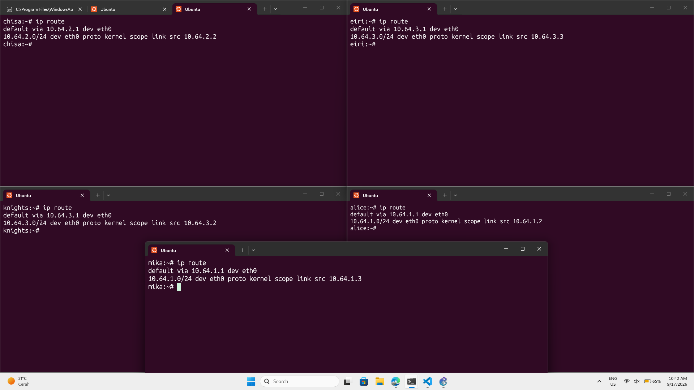

Pada Lain, IP forwarding diaktifkan agar paket dapat diteruskan antarinterface. Jika terdapat pembatasan firewall, aturan FORWARD disesuaikan agar trafik antarsegmen diizinkan.

```text
sysctl -w net.ipv4.ip_forward=1
```

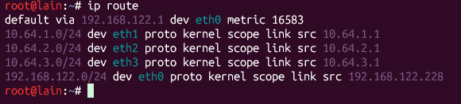

Ketiga subnet LAN merupakan jaringan yang terhubung langsung ke Lain, sehingga route menuju subnet tersebut tercatat sebagai connected routes. Client menggunakan default gateway untuk mencapai subnet lain. Selanjutnya dilakukan ping dari setiap client menuju empat client lainnya.

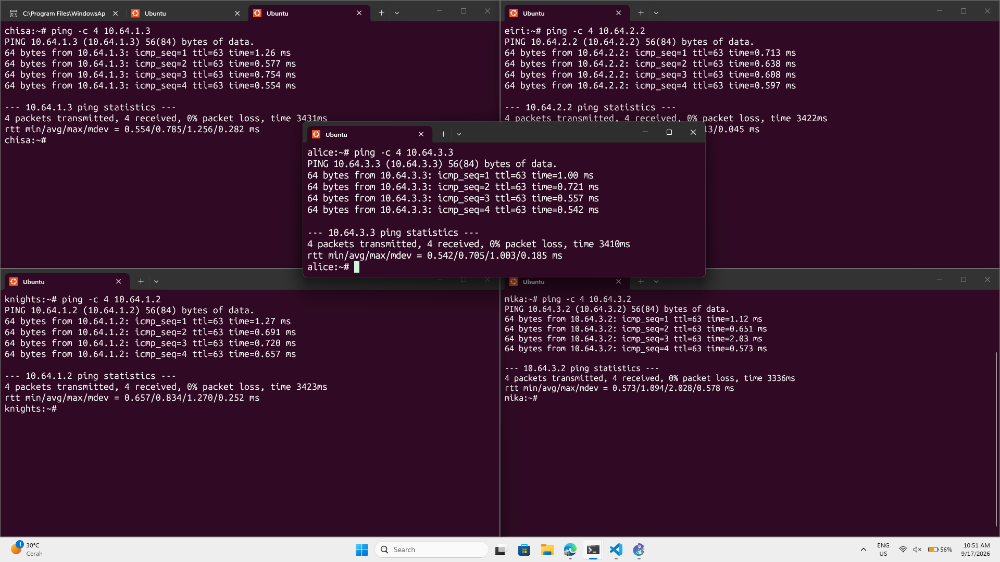

4. Lain ingin agar setiap Entitas (Client) memiliki kemandirian di The Wired. Konfigurasikan firewall/iptables (NAT Masquerade) dan DNS resolver agar setiap Client dapat terhubung ke internet secara mandiri (dapat melakukan ping ke 192.168.122.1 dan membuka domain web google.com).

Untuk memberikan akses internet kepada seluruh client, dilakukan konfigurasi NAT Masquerade pada Lain. Aturan ini mengganti alamat sumber paket dari jaringan client dengan alamat interface keluar Lain, yaitu **eth0**.

```text
iptables -t nat -A POSTROUTING -o eth0 -j MASQUERADE
iptables -A FORWARD -i eth1 -o eth0 -j ACCEPT
iptables -A FORWARD -i eth2 -o eth0 -j ACCEPT
iptables -A FORWARD -i eth3 -o eth0 -j ACCEPT
```

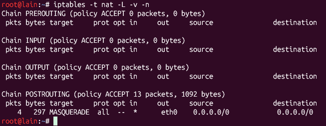

Selanjutnya dilakukan konfigurasi DNS resolver pada masing-masing client agar nama domain dapat diterjemahkan menjadi alamat IP. Resolver yang digunakan adalah `192.168.122.1` dengan konfigurasi berikut, lalu dilakukan pengujian koneksi ke internet.

```text
up echo "nameserver 192.168.122.1" > /etc/resolv.conf
```

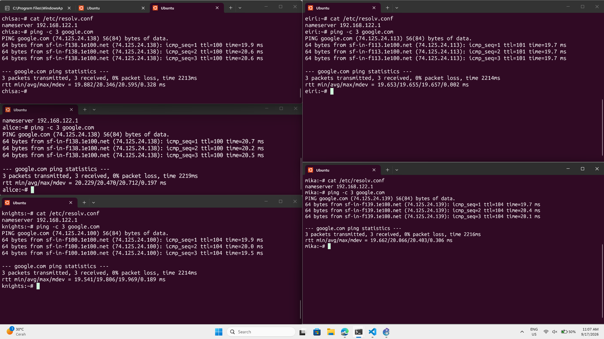

5. Eiri tetap berupaya menanamkan kekacauan ke dalam jaringan. Untuk mengantisipasi restart tiba-tiba, pastikan seluruh konfigurasi jaringan tidak hilang saat semua node di-restart. Buat script verifikasi di /root/cek_status.sh pada router Lain yang menampilkan ringkasan interface (ip -br a) dan status tabel NAT (iptables -t nat -L -v -n) setelah reboot.

Agar konfigurasi tetap berlaku setelah restart, pengaturan interface, route, DNS, IP forwarding, dan aturan iptables disimpan melalui mekanisme startup yang digunakan pada node.

**Lain**

```bash
#!/bin/bash

cat <<EOF > /etc/network/interfaces
auto eth0
iface eth0 inet dhcp

auto eth1
iface eth1 inet static
    address 10.64.1.1
    netmask 255.255.255.0

auto eth2
iface eth2 inet static
    address 10.64.2.1
    netmask 255.255.255.0

auto eth3
iface eth3 inet static
    address 10.64.3.1
    netmask 255.255.255.0
EOF

apt update
which iptables &>/dev/null || apt install iptables -y

iptables -t nat -A POSTROUTING -o eth0 -j MASQUERADE

iptables -A FORWARD -i eth1 -o eth0 -j ACCEPT
iptables -A FORWARD -i eth2 -o eth0 -j ACCEPT
iptables -A FORWARD -i eth3 -o eth0 -j ACCEPT

/root/cek_status.sh
```

**Client**

```bash
<!-- Alice -->
#!/bin/sh

cat <<EOF > /etc/network/interfaces
auto eth0
iface eth0 inet static
    address 10.64.1.2
    netmask 255.255.255.0
    gateway 10.64.1.1
    up echo "nameserver 192.168.122.1" > /etc/resolv.conf
EOF

<!-- Mika -->
#!/bin/sh

cat <<EOF > /etc/network/interfaces
auto eth0
iface eth0 inet static
    address 10.64.1.3
    netmask 255.255.255.0
    gateway 10.64.1.1
    up echo "nameserver 192.168.122.1" > /etc/resolv.conf
EOF

<!-- Chisa -->
#!/bin/sh

cat <<EOF > /etc/network/interfaces
auto eth0
iface eth0 inet static
    address 10.64.2.2
    netmask 255.255.255.0
    gateway 10.64.2.1
    up echo "nameserver 192.168.122.1" > /etc/resolv.conf
EOF

<!-- Knights -->
#!/bin/sh

cat <<EOF > /etc/network/interfaces
auto eth0
iface eth0 inet static
    address 10.64.3.2
    netmask 255.255.255.0
    gateway 10.64.3.1
    up echo "nameserver 192.168.122.1" > /etc/resolv.conf
EOF
#
<!-- Eiri -->
#!/bin/sh

cat <<EOF > /etc/network/interfaces
auto eth0
iface eth0 inet static
    address 10.64.3.3
    netmask 255.255.255.0
    gateway 10.64.3.1
    up echo "nameserver 192.168.122.1" > /etc/resolv.conf
EOF
```

Kemudian dibuat script `/root/cek_status.sh` pada Lain untuk memeriksa alamat interface dan tabel NAT setelah node dinyalakan kembali.

```bash
#!/bin/sh

sysctl -w net.ipv4.ip_forward=1

iptables -t nat -A POSTROUTING -o eth0 -j MASQUERADE
iptables -A FORWARD -i eth1 -o eth0 -j ACCEPT
iptables -A FORWARD -i eth2 -o eth0 -j ACCEPT
iptables -A FORWARD -i eth3 -o eth0 -j ACCEPT
```

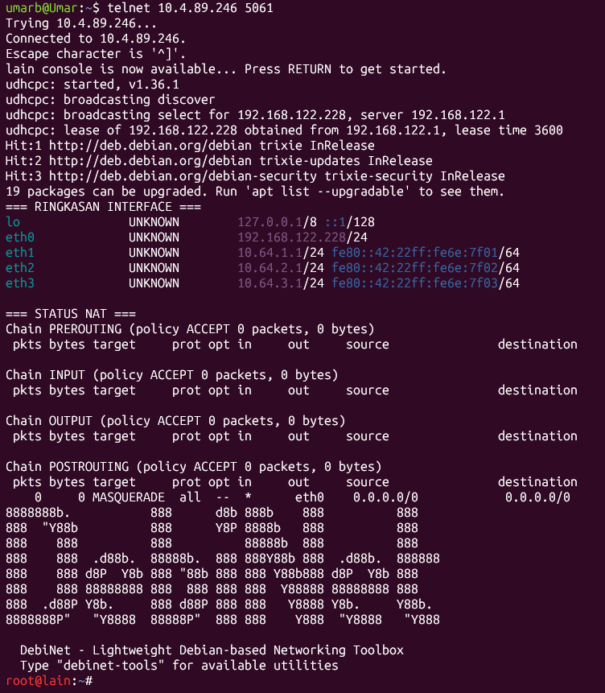

14. Pada soal ini kita diminta untuk melakukan analisis file capture `wired_bruteforce.pcapng` untuk mengidentifikasi alamat IP penyerang, target IP beserta port yang diserang, password user `lain_admin`, serta web server software dan versinya.

*Langkah Penyelesaian*

Langkah pertama kita lihat lewat menu **Statistics -> Conversations**, disini kita akan mencari di TCP untuk melihat IP penyerang, target IP, dan port nya. Klik dua kali kolom 'Bytes' untuk mengurutkan data dari angka yang paling besar ke paling kecil dan melihat adanya komunikasi dua IP dengan jumlah paket yang sangat timpang dan angkanya jauh di atas rata-rata trafik lain, itu adalah indikasi kuat aliran serangan.

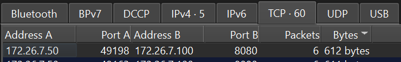

Selanjutnya, untuk mencari password user `lain_admin`, web server software dan versinya. Karena kita sudah tau nama akunnya maka, selanjutnya kita menfilter dengan `frame contains lain_admin`. Lalu kita klik kanan, **follow TCP stream**. Kita akan melihat password akun dan web server software beserta versinya.

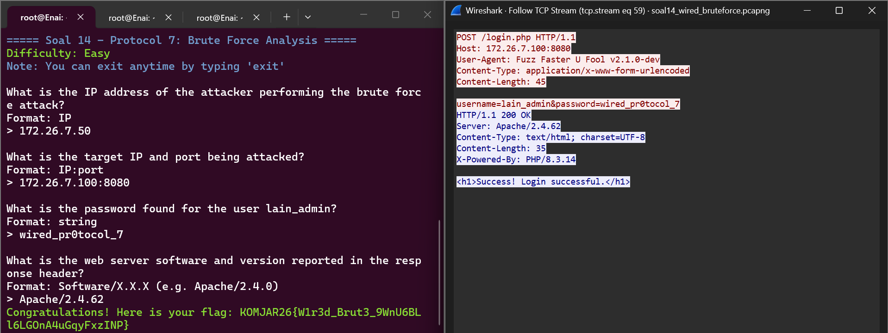

16. Pada soal ini kita diminta untuk melakukan analisis lalu lintas FTP untuk mengidentifikasi alamat IP server FTP penyerang, banner software FTP yang digunakan, kredensial login penyerang, serta ukuran (size in bytes) dari file malware knights_payload.exe yang diunduh.

*Langkah Penyelesaian*

Pertama, kita filterkan dengan `ftp.response.code==220`. Disini kita memakai kode `220` karena kode ini digunakan untuk mengundang klien untuk mengirimkan kredensial otentikasi (nama pengguna dan kata sandi). 
Kita menemukan Packet dengan info `220 Welcome to Wired FTP Server (vsftpd 3.0.5)`. Source pada packet tersebut adalah alamat IP server FTP penyerang dan info `(vsftpd 3.0.5)` adalah banner software FTP. 


Selanjutnya, kita bisa klik kanan dan **follow TCP stream**, disini kita akan terjawab kredensial login penyerang, serta ukuran (size in bytes) dari file malware.


