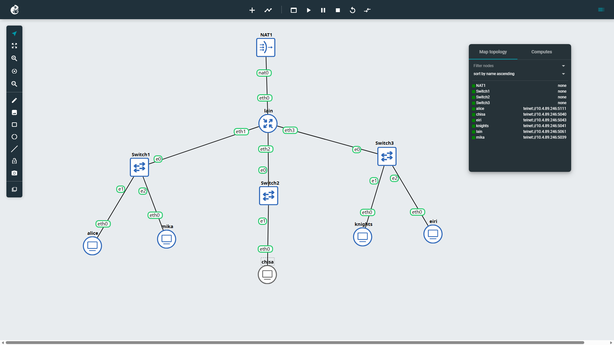
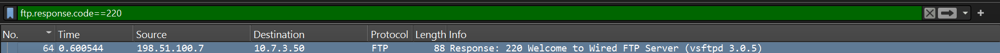
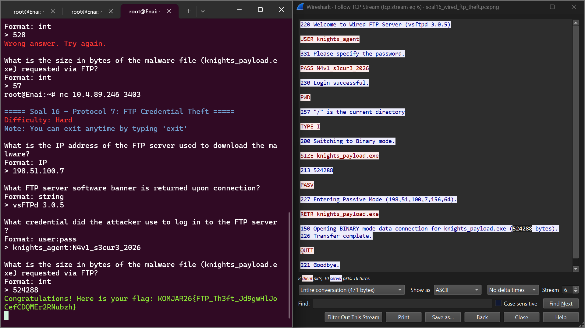

# JARKOM MODUL 1 2026 - K01

## Member

| Nama | NRP |
| --- | --- |
| Umar | 5027251005 |
| Syarifah Nailatur Rohma | 5027251109 |

## Laporan

1. Untuk mempersiapkan pembangunan The Wired, Lain yang berperan sebagai Router membuat tiga Switch/Gateway: Switch 1 menuju dua Entitas yaitu Alice dan Mika, Switch 2 menuju Chisa, sedangkan Switch 3 menuju Knights dan Eiri. Kelima Entitas tersebut dikonfigurasi sebagai Client di GNS3.

Pertama, dibuat topologi jaringan sesuai dengan pembagian node pada soal. Lain menjadi router yang menghubungkan ketiga segmen jaringan, sedangkan kelima entitas menjadi client pada switch masing-masing.

Komponen yang digunakan pada topologi tersebut adalah sebagai berikut:

- **NAT:** menyediakan koneksi menuju internet dan layanan DHCP untuk interface luar Lain.
- **Router Lain:** menghubungkan jaringan internet dengan ketiga subnet client, menggunakan image `debinet`.
- **Switch 1:** menghubungkan Alice dan Mika dengan interface LAN Lain pada segmen pertama.
- **Switch 2:** menghubungkan Chisa dengan interface LAN Lain pada segmen kedua.
- **Switch 3:** menghubungkan Knights dan Eiri dengan interface LAN Lain pada segmen ketiga.
- **Client:** Alice, Mika, Chisa, Knights, dan Eiri menggunakan image `alpinet`.

Prefix IP kelompok kami adalah `10.64.X.X`. Pembagian subnet dan gateway yang digunakan adalah sebagai berikut. Alamat gateway dikonfigurasi pada interface router Lain yang terhubung ke masing-masing switch.

| Segmen | Client | Subnet | Gateway pada Lain |
| --- | --- | --- | --- |
| Switch 1 | Alice, Mika | 10.64.1.0/24 | 10.64.1.1 |
| Switch 2 | Chisa | 10.64.2.0/24 | 10.64.2.1 |
| Switch 3 | Knights, Eiri | 10.64.3.0/24 | 10.64.3.1 |

16. Pada soal ini kita diminta untuk melakukan analisis lalu lintas FTP untuk mengidentifikasi alamat IP server FTP penyerang, banner software FTP yang digunakan, kredensial login penyerang, serta ukuran (size in bytes) dari file malware knights_payload.exe yang diunduh.

*Langkah Penyelesaian*

Pertama, kita filterkan dengan `ftp.response.code==220`. Disini kita memakai kode `220` karena kode ini digunakan untuk mengundang klien untuk mengirimkan kredensial otentikasi (nama pengguna dan kata sandi). 
Kita menemukan Packet dengan info `220 Welcome to Wired FTP Server (vsftpd 3.0.5)`. Source pada packet tersebut adalah alamat IP server FTP penyerang dan info `(vsftpd 3.0.5)` adalah banner software FTP. 

Selanjutnya, kita bisa klik kanan dan **follow TCP stream**, disini kita akan terjawab kredensial login penyerang, serta ukuran (size in bytes) dari file malware.

